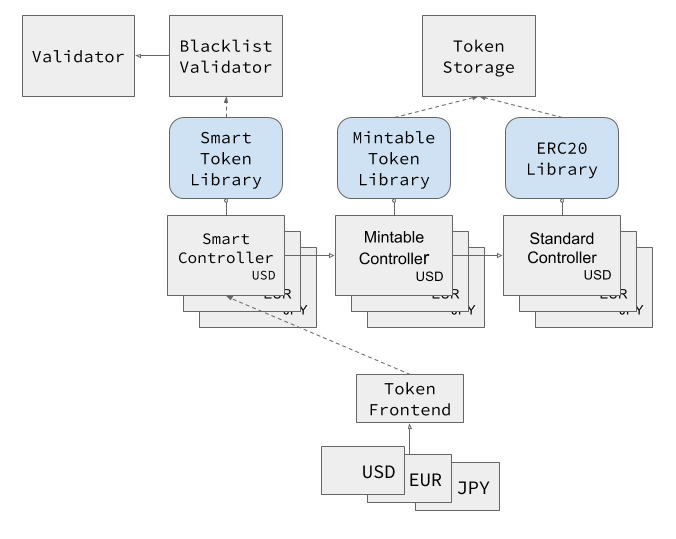

# (Smart) Fiat Token

ERC20 is a suggested specification for Ethereum tokens. Once approved as an Ethereum Improvement Proposal (EIP), it will become a part of the standards for the Ethereum platform.

Smart contracts adhering to the specification have a common interface to token-related functionality and events.



Our tokens are designed as a token system and implemented using Solidity libraries. A token system is a methodology which aims to separate the token into three modules, providing the means for composable and upgradable tokens.

	1. Frontend
	2. Business logic
	3. Storage

## Building

1. Clone the repository
	
	`$ git clone --recursive https://github.com/monerium/smart-contracts.git`

2. Install dependencies

	```sh
	$ npm install -g ethereum-testrpc
	$ npm install -g truffle
	```

3. Run `testrpc`

	`$ testrpc`

4. Compile token system

	`$ make compile`

5. Deploy

	`$ make migrate`

6. Run test suite

	`$ make test`


## Token interface

```javascript
pragma solidity ^0.4.8;
 
// ----------------------------------------------------------------------------------------------
// Sample fixed supply token contract
// Enjoy. (c) BokkyPooBah 2017. The MIT Licence.
// ----------------------------------------------------------------------------------------------
 
// ERC Token Standard #20 Interface
// https://github.com/ethereum/EIPs/issues/20
contract ERC20Interface {
    // Get the total token supply
    function totalSupply() constant returns (uint256 totalSupply);
 
    // Get the account balance of another account with address _owner
    function balanceOf(address _owner) constant returns (uint256 balance);
 
    // Send _value amount of tokens to address _to
    function transfer(address _to, uint256 _value) returns (bool success);
 
    // Send _value amount of tokens from address _from to address _to
    function transferFrom(address _from, address _to, uint256 _value) returns (bool success);
 
    // Allow _spender to withdraw from your account, multiple times, up to the _value amount.
    // If this function is called again it overwrites the current allowance with _value.
    // this function is required for some DEX functionality
    function approve(address _spender, uint256 _value) returns (bool success);
 
    // Returns the amount which _spender is still allowed to withdraw from _owner
    function allowance(address _owner, address _spender) constant returns (uint256 remaining);
 
    // Triggered when tokens are transferred.
    event Transfer(address indexed _from, address indexed _to, uint256 _value);
 
    // Triggered whenever approve(address _spender, uint256 _value) is called.
    event Approval(address indexed _owner, address indexed _spender, uint256 _value);
}
```

## Implementation

TODO

### Solidity libraries

TODO

### Token Systems

TODO

### Additional functionality

TODO

## Development

* testrpc
* truffle

TODO

## Deployment

```sh
# truffle migrate [--network <name>]
```

TODO

## Unit tests

```sh
# truffle test
```

TODO
