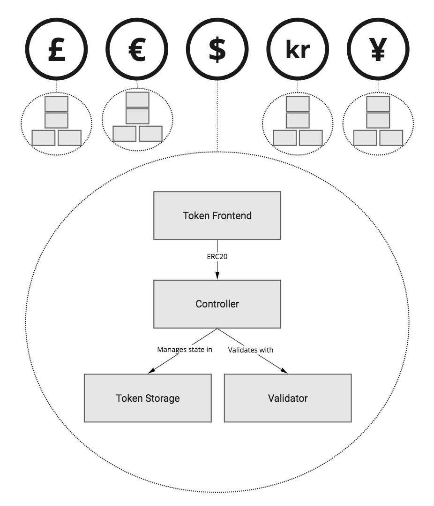
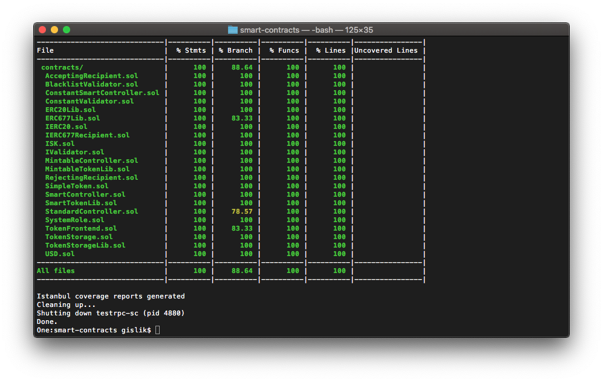

# 


The [Monerium](https://monerium.com) e-money platform offers programmable fiat money on blockchains, an indispensable building block for the nascent blockchain economy.

## Token Design

Four cooperating Ethereum smart-contracts are deployed for each e-money currency token that is [ERC20](https://github.com/ethereum/EIPs/issues/20) compliant.

* **Token Frontend**: This contract implements the [ERC20](https://github.com/ethereum/EIPs/issues/20) token standard and provides a permanent Ethereum address for the token system. The contract only exposes the required ERC20 functionality to the user and delegates all of the execution to the controller.
* **Controller**: The controller is responsible for the business logic. The controllers are further separated by the functionality they provide into; StandardController, MintableController and SmartController. 
* **Token Storage**: Storage of e-money token ledger.
* **Validator**: The validator can be used by the controllers to approve and validate transactions before they are made.



Using this design we're able to upgrade the business logic, to fix bugs or add functionality, while providing a fixed address on the blockchain and permanent access to the token bookkeeping.

### Implementation

The token system is implemented using Solidity, the most widely used high level language targeting the EVM. We build upon community vetted libraries where possible to minimize the risk of bugs.

Additional functionality has been implemented in `MintableTokenLib.sol` and `SmartTokenLib.sol`. This includes minting and burning tokens and defining validators who determine whether token transactions are valid or not.

Functionality which requires authorization is protected by OpenZeppelin's implementation of the Ownable contract. The management of the private key of the owner is very simple at the moment but for v1.0.0 a multi-signature account or a simple DAO will be used.

### Solidity libraries

Libraries in Solidity provide the means to deploy an implementation once as a compiled byte code but without an execution context (storage). Contracts deployed subsequently can then be statically linked to the library.

Our token system takes advantage of this feature to save gas deploying multiple tokens. It can also be argued that sharing audited libraries between contracts can reduce the risk of bugs and worst case ease the replacement of a buggy implementation.

## Building

1. Clone the repository

    ```sh
    git clone --recursive https://github.com/monerium/smart-contracts.git
    cd smart-contracts
    ```

2. Install dependencies

    ```sh
    yarn install
    ```

3. Run truffle

    ```sh
    npx truffle develop
    ```

4. Compile token system

    ```sh
    truffle(develop)> compile --all
    ```

5. Deploy

    ```sh
    truffle(develop)> migrate --reset
    ```

6. Run test suite

    ```sh
    truffle(develop)> test
    ```

## Development

To ease the development, deployment and interaction with the token system we're using truffle.

Truffle's ganache simulates full client behavior and makes developing Ethereum applications much faster while Truffle is a development environment, testing framework and asset pipeline for Ethereum.

Development happens on the master branch and we use [Semantic Versioning](http://semver.org) for our tags. The first pre-release version deployed on a non-testrpc blockchain is v0.7.0.


## Deployment

```sh
# npx truffle migrate [--network <name>]
```

The deployment cycle for beta versions (up to v1.0.0) is as follows. During development the smart contracts are continuously deployed and tested locally on testrpc. A patch version update is deployed on the Monerium testnet, a federated blockchain, run by Monerium. A minor version update is deployed on the Rinkeby testnet.


| Contract               | Rinkeby 																		|
|------------------------|--------------------------------------------|
| ERC20Lib               | 0x218bb707be04ab12a28e339cd654b151a9a72d9e |
| ERC677Lib              | 0xc9d673d30b9598a70c63ebe72f0167fc80e431f0 |
| ISK                    | 0xe6f9ad37afe22edc33c482d7694b90333d14498e |
| Migrations             | 0x8222eca943e85b08f509436d8cf6314bcb8a0bb4 |
| MintableTokenLib       | 0xf09b796c0cd1a9569a0a2d92512c101bfb47fbb3 |
| SafeMath               | 0x4031b16a22f650b132643dbe2481a7db3ce22340 |
| SmartController (ISK)  | 0xd2d5f6ee4fb0182e1735bbda2e8103099d3b4aa1 |
| SmartController (USD)  | 0xe2482f228a7098d9d58e5f70d4712d46e7ba7310 |
| SmartTokenLib          | 0xdada997f5c49cac5d458bc4e3caf28e741eac037 |
| Storage (ISK)          | 0x5881f17c4627cfee259a852ee96f8f23e641e6c5 |
| Storage (USD)          | 0xe8d4741d06dbf08dd323c1f7972ceb09283674e8 |
| TokenStorageLib        | 0x855368e1c36415de1e9624dbf2d93c7efed4baa4 |
| USD                    | 0xb63baffa7f19b1eeec270804b359b858a330bf20 |

Current version is v0.9.8.

## Unit tests

The token system ships with JavaScript unit tests.

```sh
# make test
```


## Code coverage

Code coverage for the token system can be checked with [solidity-coverage](https://github.com/sc-forks/solidity-coverage).

```sh
# make coverage
```



Copyright &copy; 2019, Gísli Kristjánsson for Monerium ehf.
